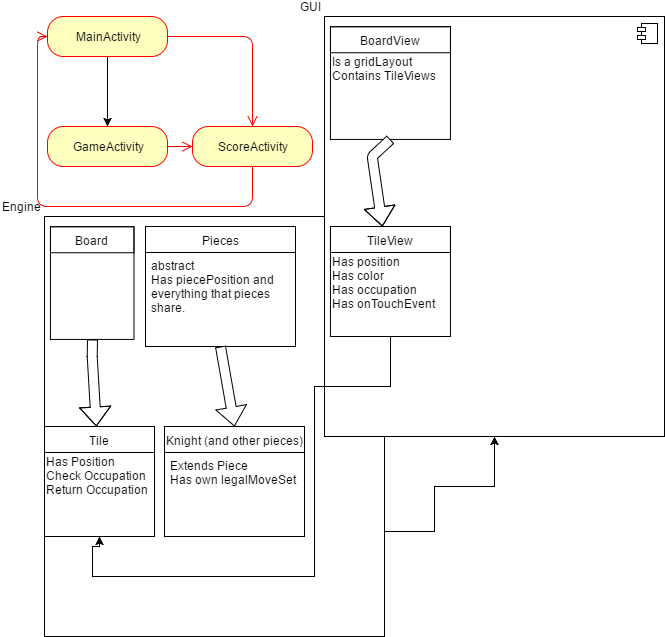
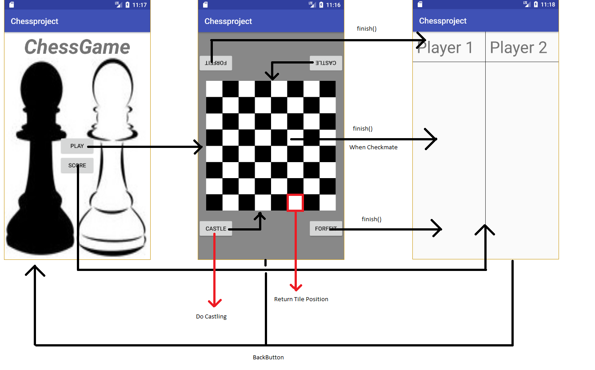

# DESIGN ChessGame
## Tristan Hoobroeckx

This is a representation of how I think it should work. The engine keeps track of the game and the GUI displays the game and handles touchEvents. Piece is an abstract class of which all pieces* extend. Pieces* override some functions of Piece that should be different for that piece. An example is the legalMoveSet, which is different for each type of piece. Things like position and Alliance are variables that each piece possesses and should be handled the same. 

My old BoardGridView extended GridView and in its overridden onDraw method drew squares of a certain dimension and painted them black. Whether or not a black square was drawn depended on a mismatch between modulus of row and column. If they were both '0' or '1', no square was drawn (leaving a white space), and if one of them was different from the other, a black square was drawn. This returned a chessboard that could return (via onTouchEvent) the coordinates of a tile. Though I am having problems getting the pieces inside the squares. I thought it might be better to have individual tiles and have them have a position and a color attribute. 

So I made a TileView class which extends imageView. This TileView will have a position that could be matched directly to its counterpart in the engine. This way when a TileView is clicked it can return its position and the engine will understand which tile to address. It can then check its occupation.

GameActivity should only start the GUI and I am hoping that this way when the Activity is destroyed, the game will remain, because the variables inside the classes still should have their values and the GUI can just rebuild from them.

