# day 1 Tuesday
Since I thought that making a prototype was going to be tough, I already started on the board in the weekend. This days deadline was for a proposal however so I began to write that. Now with it finished, I am going to focus on the prototype again.
# day 2 Wednesday
The visual representation of the board is finished, but I am having a hard time actually placing pieces on it. It might be better to have actual individual tiles placed in a gridlayout that handle their own colour and occupation rather than having a custom gridview with tiles drawn on it which nevertheless returns proper coordinates.
What I really want to do is retain my custom gridview and have an imageview of a piece inflate into it. It is a challenge, because I haven't started on the engine yet and that will be where piece coordinates come from. I have created a position converter in case I want to implement a one-dimensional board on engine level and a two-dimensional board on GUI level. I have created a Piece class and a Knight class that extends Piece. After all I want to place some pieces on the board. I do think that the current state of the prototype is sufficient. 
# day 3 Thursday
Tried to build a board made of individual tiles today. Not a success. Yet. The board doesn't display. Should be at this point all be black tiles, but is empty gridlayout.
I think that I am going to focus on the engine from now on, no point in making a GUI for a facade. It might be best to give pieces two-dimensional coordinates.
# day 4 Friday
Started work on the engine. Started by building pieces and movetypes. So far I have started work on the knight, the easiest piece, since it can jump over other pieces. This means no checking for pieces in its path. I took a very literal approach. By this I mean that I visualized a game of chess in my head and on the whiteboard, worked out some coordinate-offsets and put them in an two-dimensional array called POSSIBLE_MOVES.
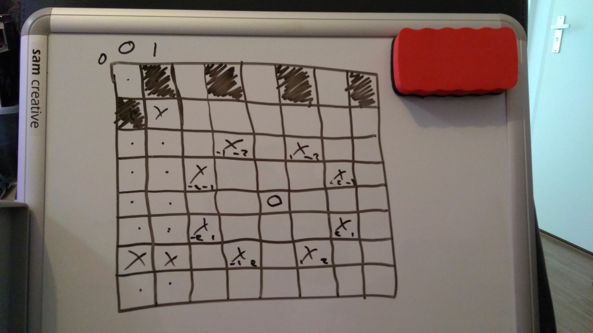
Add the offset to the piecePosition and check if there is another piece. At this point I needed two different moves: A 'Normal' move, and an 'Attack' move.
# day 6 Saturday
Today I started the Move classes and the rest of the Pieces. The Bishop needed a three-dimensional array because of its four directions and its two coordinates. For the rest it is similar to the knight. The Rook is just a copy of the Bishop, though with a different moveset and the Queen is probably best described as the culmination of the Bishop and the Rook (moveset wise). The Pawn though, has a very unique moveset as it can jump two squares in its first move and attacks diagonally. It would also be able to take pieces en passant, so it needs to check at its sides too. Opposing Pawns also move in different directions. So I think the Knight, Bishop, Rook, and Queen are finished, but the Pawn needs some work and the King too. 
# day 7 Monday
Today I created the board in engine, which is just a set of lists of tiles and pieces. However it is now still riddled with bugs and invoked virtual methods on null object references. As I am not that good at debugging, I'm going to need some 'expert' help on this. The only thing it should do is Map tiles of different coordinates to a Tilenumber. Do the same for the pieces and their movesets. I'll look into it tomorrow.
# day 8 Tuesday
Today I started bug-fixing. Using the debugging console, I found that my board was drawing black pawns on the first row, while this is where the higher pieces should be. It also drew an additional line of empty tiles. It took me way longer than I would like to admit to realize that when creating the pawns I set the yCoordinate for the black pawns to 0 instead of 1, and thus overlaying the higher pieces. Now using the debugger I ventured to find out why the app was crashing. It turns out that when I try to make a list of all the possible moves (which I need later to verify with the board that the selected move is legal) there seems to be a problem with the legalMove method in Piece. This leads to no Moves being added and so the trackMoves method in Board doesn't get any Move objects.
I commented the making of this list out for the moment. The app ran fine and I was able to make an ASCII representation of the board. This was achieved by overriding the toString methods of all pieces and empty tiles.
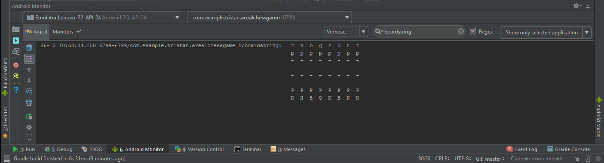

``r n b q k b n r``  
``p p p p p p p p``  
``0 0 0 0 0 0 0 0``  
``0 0 0 0 0 0 0 0``  
``0 0 0 0 0 0 0 0``  
``0 0 0 0 0 0 0 0``  
``P P P P P P P P``  
``R N B Q K B N R``

This evening though, I found the culprit. My legalMoves methods inside the pieces was using a getTile method from Board, that I had return null... had it return a tile and now everything is fine. The next step is maybe connect this to the GUI and finish the alpha build.

In the BoardGridView, I have implemented a method that returns a string key to a resourceID in a List. This resourceID is for each individual piece. The method takes coordinates from the nested for-loops in the onDraw method and recovers the belonging piece. The resulting resource is made into a Bitmap and if it isn't null, it is drawn in the onDraw method (if on black, after black is drawn). I switched the x and y coordinates by accident though and even though the pieces were in the wrong spot, all pieces were drawn. So I switched the x and y values and now some pieces are missing (but what pieces there are, are in the right place). I don't know why. Guess I'll find out tomorrow.  
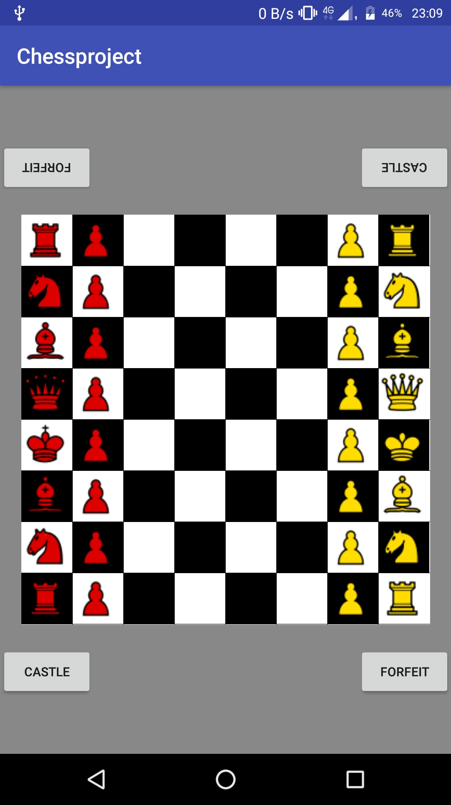
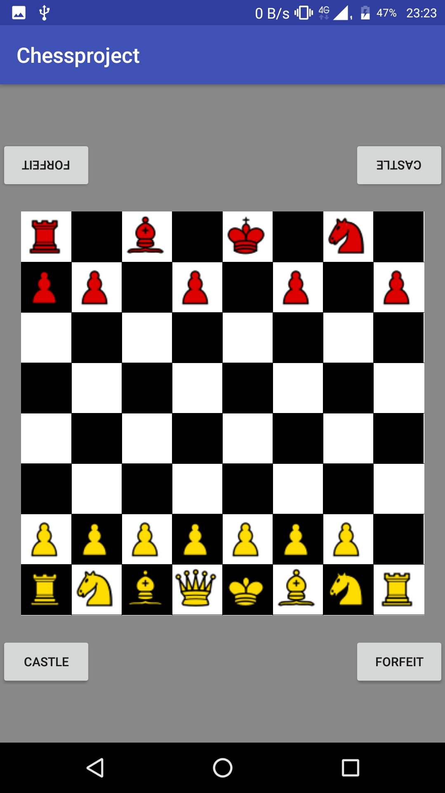
# day 9 Wednesday
So I noticed a little speck on my screen. When I dragged the emulator it moved with it. It was right on the border with the black King's tile. It must be part of the queen that was drawn outside her tile! I realized that for some tiles the black tile was being drawn over the pieces. I split the drawing of the tiles and the pieces into two nested for-loops to make sure the tiles were drawn first and this fixed it. It also made me think that the bitmaps of the pieces were not scaling. Which is true.  
The below images have titles, hover to get a sense of their dimensions.  
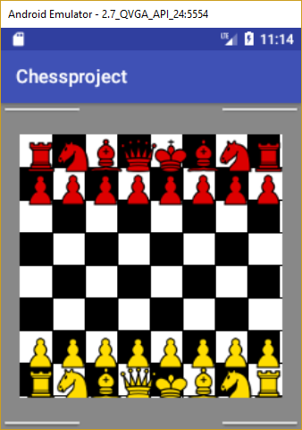
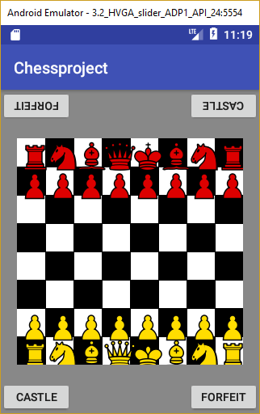
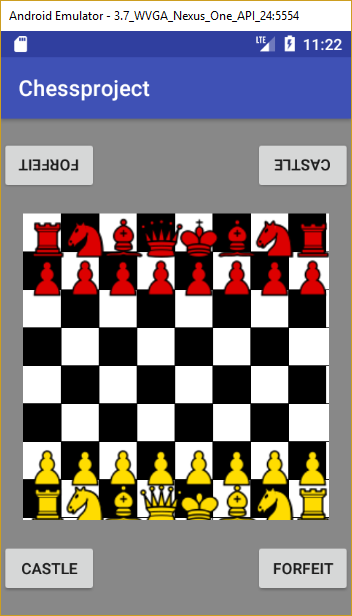
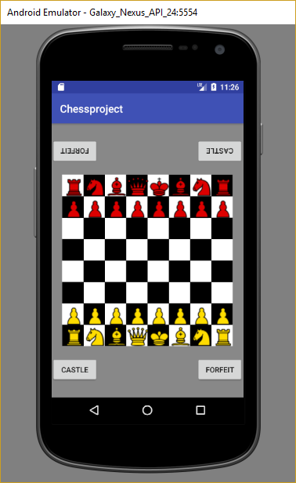
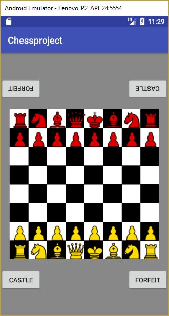
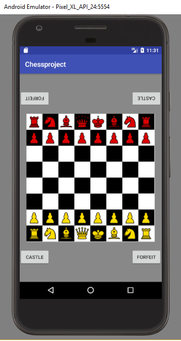

The chesspieces are inside the tiles from 720x1280 and up and resolutions lower than 320x480 are unplayable (buttons fall off the screen). I don't think this is necessary to fix, since the app targets API 24 and no phone that runs this has a resolution lower than that.  
The next step would of course be to make the pieces movable. Since we don't want to be able to move the pieces of the opponent, I think it best to start with making a player class that keeps track of who's turn it is. I have an onTouchEvent in BoardGridView. This should send coordinates to some class (Probably Move or Board) and get a piece on that tile (may be null). Then when we tab again we should move this piece to the new tile. This will involve making a new board that has the piece moved. Then I will call invalidate() in the onTouch() method and the View should redraw itself based on the new board.

So it makes sense to have the players make the moves... so that is the plan now. We probably want to know who is next, so we ask the current player who he is playing against. This means two classes that are nearly identical (the two players), so I'm going to make an abstract player class that has a makeMove function. I recently made a singleton out of the board... so I am probably undoing that. If I am going to make a new board, then board can't be a singleton right? 

But Move holds the move! So I should get the move that corresponds to the coordinates of the onTouch method, validate the move and then execute the move. This should be done inside the Move class?
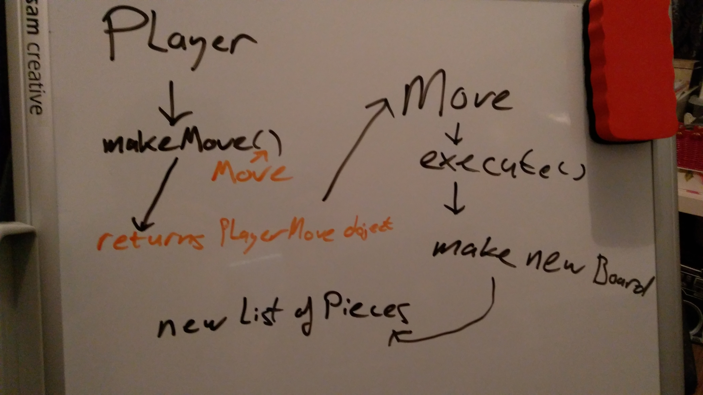
Since this photo was taken the PlayerMove Object has been refactored to AlternateBoard.

The player is making the moves, but the moving will be done by the move itself. The player can validate a move and return the same board if the move is illegal (meaning it isn't in the legalMoves list). Otherwise a new board with the piece moved should be returned. 
# day 10 Thursday
I set the player to white. I tested the moving of a piece as it is right now, but the move is never executed. I have made the board a singleton again and made the instance static. I hope this way that I can set the instance to the new Board and then call invalidate(). This should lead to the Board being redrawn with the new altered instance. I found that the move I tried to do was marked as Illegal and therefore it was not executed. 
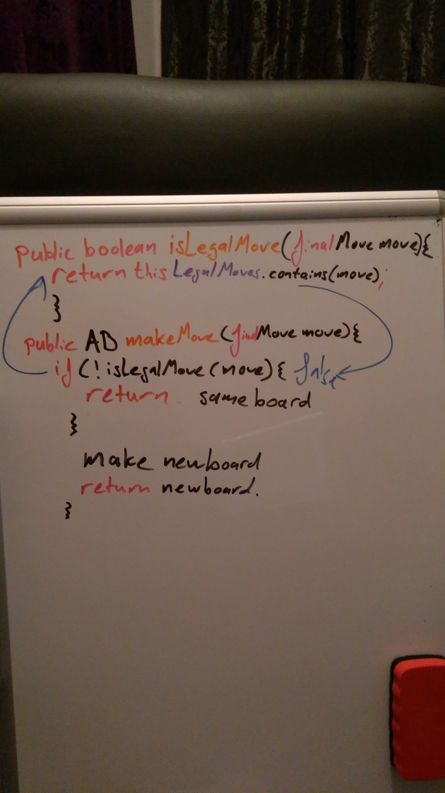
This was because when I was checking if the chosen move was in the collection of legal moves (using a boolean and legalMoves.contains(move)) that move wasn't in the collection. legalMoves contains all the moves from all the pieces for a given player. Essentially half of all the moves. So I made a new collection with all the moves from all the pieces on the board and for some reason the chosen move is in there. Can't explain it. So I checked the move there (allMoves.contains(move)). The pieces move now, but when I try to take a piece the board resets. Didn't expect that, though it comes in handy when I need to reset the board. Also when I move the same piece twice without moving a piece from the opponent, the piece gets copied instead of moved. This is likely linked to the fact that I reference with every piece's moves on the board. This also explains why I can begin a game by moving black pieces, while white should have first turn. I shouldn't be able to move the opponents pieces because they aren't in the current player's legalMove collection. It could be that when I earlier tried to reference from the white player's move collection, it was actually black's turn, and that they had switched somehow before a move was made. 

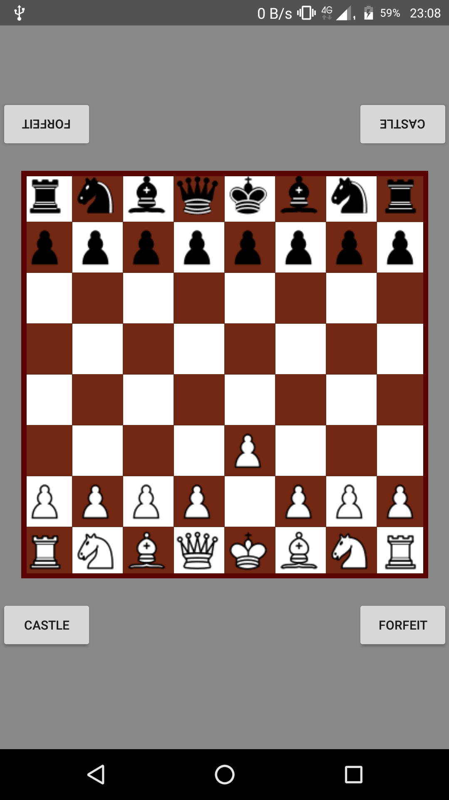
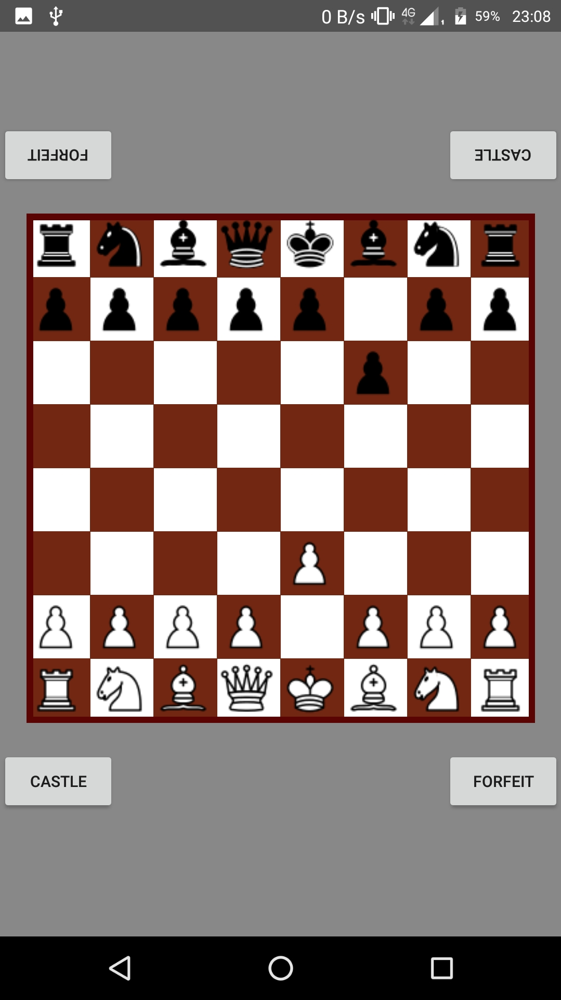
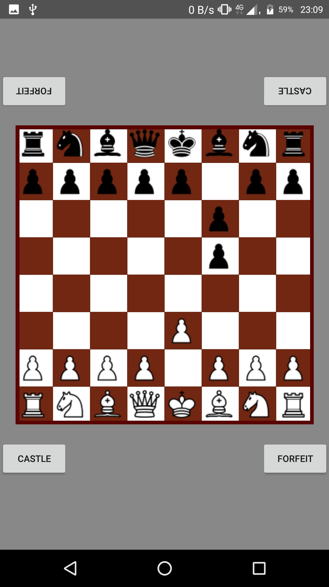

# day 11 Friday
With the Beta version coming in sight, I needed to finish the enforcing of rules and making sure that everything worked without crashing. I am going to make an AI to play against. Today I created different moves for the Pawn. The pawn is a special piece with special rules. For example it may jump a tile, but only in its first move. So I created a move for that, so that when that move was executed the boolean that tracks if it is the first move can be set to false by that move. Should work. Pawns can also strike en passant, so I made a move for that. And the pawn wasn't fully fleshed out, so I did that. Also the pawn needs its own Normal and Attack move, because these moves must set its isFirstMove boolean to false.

# day 12 Saturday
Fixed some bugs. I limited the selecting of a piece on GUI level. This fixed the bug where you can select and move the opponents pieces. I also had the Player search in its own list of moves again in stead of all the moves and suddenly this just works. Literally just changed allMoves to legalMoves and it was fine. I also decided that I would highlight the selection and possible moves. This will help me debug some issues and faults. I found out through the highlighting that sliding pieces would have moves beyond pieces that 'are in the way'. The queen could teleport behind enemy lines. Fixed this. Highlighting looks like this.
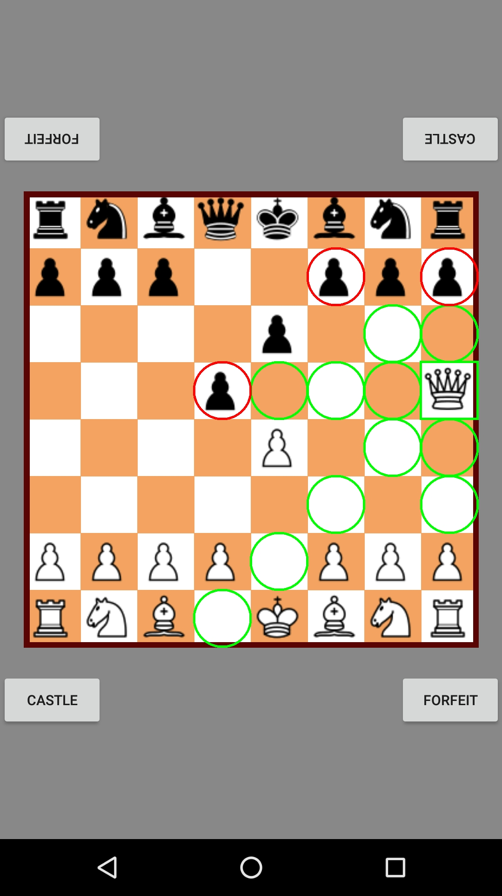
I also had the players check if they had a king when a new board was introduced. This is for when for some reason the king has failed to make it to the next board, there would be a runtime error. This has led to crashing when the king is taken. This should be fixed when we check for check and checkmate. Also now that MoveAttack is fully functional, the board doesn't reset when a piece is taken. Now I must restart the app to reset the board. I should implement a reset board button. 
# day 12 Sunday
Today I must finish castling, taking a piece en passant and checking for check and checkmate. Checking for en passant could be easier than expected. When a pawn executes a MovePawnLeap a new board is created. So on this new board we could make a variable that saves which pawn has just moved (enPassantPawn). When we make the legal moves for a pawn, we can check if this variable is not null and if the tiles at the sides of the pawn is the enPassantPawn that has performed the leap the previous turn. We then make a MoveAttack in that xDirection and take the enPassantPawn. According to the rules if you wish to take a pawn en passant, you should do so in the first turn after the pawn has moved. When we store this inside a variable we do this for the next board, but not for all subsequent boards (unless it occurs again). This means that when another move is made that isn't a PawnLeap move a new board is made that hasn't stored the enPassantPawn. The enPassantPawn can no longer be taken.

Castling is moving the king two tiles to either side and place the rook of that side on the other side of the king. The tiles in between them should be empty and neither the king nor the rook of that side has moved previously. The king also can't castle in or out of check. So we should check for these things. Castling involves two pieces so I will have the player create the castlingMove. They can check inside their enemy's moveset to see if they have moves that target the tile that the king will be occupying or moving through. So for both of the tiles that the king will be moving through there should not be an enemy move to that tile. 

The enPassant move is showing, but when trying to execute it is ILLEGAL. Castling is done inside the Player class. It is not added to the legal moves of King. I need a way to add two Collections and make them into one. Or I could move the Castling to the king. 

About the AI. I have found an algorithm called MiniMax. It evaluates the board on some criteria and gives it a score. A low score would mean that the one player is winning and a high score would mean that another player is winning. Let's say that the AI wants a high score. Then it would pick a move that after a few turns would lead to a board with a higher score. Per layer it will compare boards to pick find the highest scoring board. Layers are alternating Min and Max. In Min layers it will pick the lowest score and in Max layers it will pick the highest score. 
# day 13 Monday
Today I fixed the castling feature. Castling is now possible as long as the king isn't in check. But the king never is in check, even when it is definitely in check. This means that the king can castle out of check. However, I fixed the makeMove method in the player class the next day, so now only moves that prevent the king from being under attack in the boards that they would make are accepted. I also fixed the highlighting for castling moves. They are now a purple circle. Taking a piece en passant still doesn't work.
# day 14 Tuesday
See monday, and today I made the MiniMax algorithm and the accompanying evaluator. The algorithm was pretty straightforward. For every possible move a board is made and for every possible move on that board a board is made, and so on. These 'layers' represent moves a current player would make. It is co-recursive and is limited to a set depth. Once this depth is reached, the evaluator starts evaluating the boards. The boards are evaluated on piece value. The player with the highest piece value is winning. The evaluating subtracts the blackPlayer's piece value from the whitePlayer's. This leads to a winning board for the whitePlayer when the score is positive and for the blackPlayer when the board is negative. So on layers where the blackPlayer moves the board with the lowest score is chosen and on layers where the whitePlayer moves the board with the highest score. This eventually leads to a move that the AI can make, that ensures a few turns ahead that black is winning. Tomorrow I'm going to link the AI to the game.
# day 15 Wednesday
So the AI needs to know when to start choosing a move. It would need to know that the current player has changed to whatever the AI is. I wanted to make the board observable and notify the observers that the current player has been changed. I could also make an external Observable that changes with the board.
# day 16 Thursday
Checkmate is detected. Connecting AI is harder than expected. I have now have the components divided among different classes, but maybe it is better to have them in one class as subclasses. I need to invalidate the BoardGridView, but I can't from an external class without passing the reference in.
# day 17 Friday
Preferences menu is now fixed and Engine knows which player is a computer and which isn't. I hadn't notified the GameChanger of the changed sharedpreferences, so I made a listener for it. Now when I make a move, when I log the type of player it corresponds with the settings. In order to make GameChanger notice the preference change I had to have it implement Preference.OnSharedPreferenceChangeListener. A lot of the functionality of the Setup class in conjunction with the SettingsFragment depended on there being context. So I had the MainActivity update the context of a StaticApplicationContext class to the application context. I did it this early to make sure that the context was already present when GameActivity (which calls GameChanger which calls the Setup class) was started.
# day 18 Saturday
Today I succeeded in connecting the AI. In summary: GameChanger is an Observable that has a variable current player. Every time current player changes (due to the board being refreshed) GameChanger gets its current player updated also. After every move made, be that by human or computer, a moveUpdate() method is called within GameChanger that notifies all observers that something has changed. TurnWatcher is an Observer that observers GameChanger. When its update() method is called because it is notified of the change in GameChanger it starts an AsyncTask that runs the minimax algorithm in the background and returns the bestMove and onPostExecute() gets that move and executes it, updates the board and invalidates BoardGridView. 

Invalidating BoardgridView wasn't possible from another class unless you pass its reference. So that is what I had to do. I shoved all necessary classes into GameChanger and tried passing GameChanger the reference. Had I forgotten to mention GameChanger is a singleton and I get its instance from many other classes? Well that would mean that I had to reinstantiate the reference every time I used the GameChanger instance. So I couldn't instantiate the BoardGridView reference in the constructor in case I had to use it from somewhere I couldn't get that reference. So I made two getters for the instance (one of which I passed the reference) and made the BoardGridView reference static within GameChanger. Now that it that reference is static, putting all those classes as subclasses in GameChanger doesn't make as much sense. So with everything done I started the game and the computer did absolutely nothing. Not one move. Turns out I forgot to list TurnWatcher as an observer. 

Now it actually worked! I had the depth at 2 and I have to say, the algorithm is pretty aggressive in taking pieces. The boards it evaluates are evaluated for piece value. This leads to the algorithm making moves that causes the other player to lose pieces (2 turns ahead). Also in the beginning of the game the algorithm always makes the same move, the rightmost pawn. I believe this is because it doesn't see a difference in scores between potential boards and picks the last piece whose possible moves it has evaluated. I think that if we add certain 'scorepoints' to the evaluator (think of whether the opponents king is in check or not). A 'scorepoint' to remedy this setting of the last evaluated piece could be Possible Move Count. The more moves you can make in the next move the better. This would probably lead to the pawn in front of the king being moved first since the opens up the queen and the right bishop. I also noticed that the Computer doesn't Castle. This is because I haven't given this state of the board any extra points. The balancing of allocated points must carefully done, because Castling is a move that is non-repeatable. It shouldn't be done too early but also not too late. Also the possibility of Castling is wasted way too early. The computer moves its king and rooks way too eagerly. I should retrieve the possibility of Castling from the board and allocate it some points. I already started allocating points to boards where the king is in check to stimulate this behaviour. About the settings: You can change the settings in-game, but at the start of a Computer versus Computer game, the user must still initiate the first move. Also CvC games always end in two pieces moving back and forth between two locations. This will hopefully be remedied by expanding the evaluation of boards.

The algorithm isn't particularly fast. At depth 2 it makes a move approximately every second. This is near half a minute on depth 3 and depth 4 takes near an hour. This would be at this rate around 30 hours on depth 5 (+- 10 hours, depending on how many moves are possible but not necessarily executable). I think that I am going to limit the depth to be either 1, 2, 3, or 4 (4 for people with a lot of patience and a large battery).