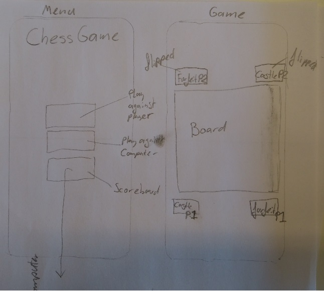
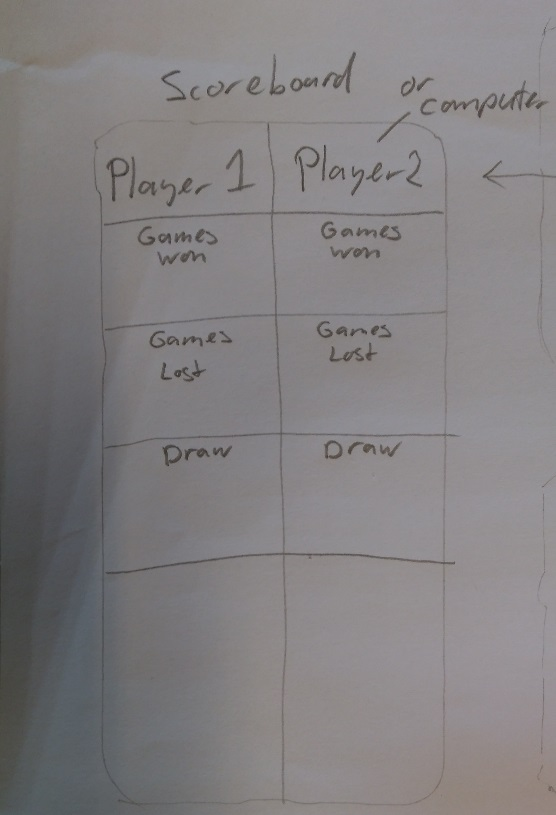
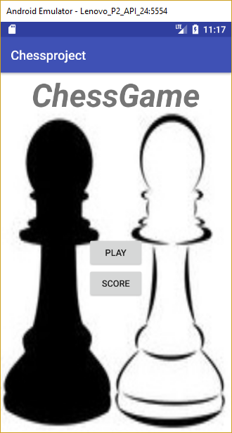
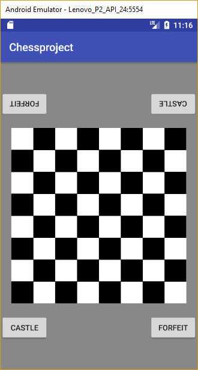
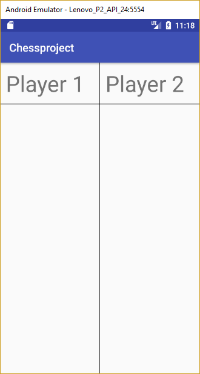

# README for ChessGame
## Tristan Hoobroeckx

### Summary:
I aim to make a very minimalistic chess-app. It will have a chess-engine and a Graphical User Interface (GUI). Due to time-limits and foreseeable difficulties, I will optionally add the Castling and en passant moves, and an AI to play against.

### Problem:
If you want to play a game of chess against a friend, most of the time you will be bringing your board and pieces. This might be unwieldy. This app provides a means to bring a game of chess on your phone which is presented as a real board would be. You can play a game on one phone without requiring an internet connection.
### Features:
Pieces and buttons are flipped for the opponent. A board will be presented. Pieces can be moved by selecting them by tapping and then tapping a destination-tile. Possible moves will be highlighted and the user is notified when an illegal move is attempted. Certain rules will be enforced.
### "Sketches"

### DataSets and DataSources
At the moment there are no plans to use dataSets and dataSources. The app should contain all the data it needs.
### Parts
The App consists of two parts: the engine and the GUI. The engine is the actual game being played, actions performed, and such, but is not very comprehensible for the players. The players are shown a comprehensible GUI that presents the game that is being played on engine-level.
### External Components
At the moment there are no plans to use external components. The app should contain all the components it needs.
### Potential Technical Problems and Limitations
Castling and Taking a piece en passant can be difficult to implement. AI can also pose difficulties. For moving the pieces in engine it might be easiest to give each tile a number and have the piece traverse back and forward in tilenumbers according to what a legal move is. A legal move could be for example -20 or 15. This is a one-dimensional (one coordinate) representation of the board, while the GUI is most likely two-dimensional (two coordinates), so a conversion must be made each time.
### Review Similar App
Chess is an app that implements a board and pieces and is probably much more elaborate than I can make it in this short time. This app also flips buttons and pieces if the players so choose. In my app this will be the only choice. Its style is not minimalistic enough for my taste. It is too dark and poorly visible when the brightness is turned down. The user will want to turn the brightness down to have lasting battery-life as a game of chess can take a while. I aim to make a very minimalistic chess game, that is well visible in low brightness. 
### MVP
All pieces must be selectable and movable according to the rules onto a chessboard. When a game has ended the result must be displayed onto the Scoreboard. Optional parts to implement is 'Castling', and 'Taking a piece en passant'. Implementing AI is also optional, all if time permits.

