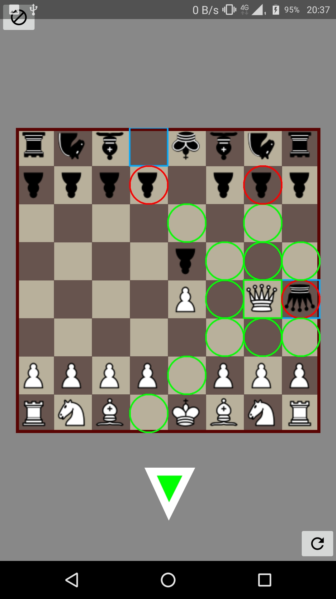

# REPORT ChessGame

This app is essentially a chess game. You can play against a friend with the phone in between the two of you, or you can play against your phone. You can also have your phone play against itself. There are four difficulty settings, which is really how many steps the computer thinks ahead. Each subsequent difficulty also has longer 'think-times', during which the computer calculates the best move.

## High Level Overview
The app mostly consists of two components: the engine and the graphical user interface. 

The engine consists of:
 
* board and tiles
* moves
* pieces
* players
* an Alliance enum
* a PieceType enum
* a Setup class
* and a Tools class.

The GUI consists of:  

* MainActivity
* GameActivity
* SettingsActivity
* SettingsFragment
* a custom GridView named BoardGridView
* and a custom View named BackGroundView.

Outside these components live the GameController and the StaticApplicationContext.  

## Detail
### Board and Tiles
Tiles are objects that hold an x and y coordinate and possibly a piece. There are two types of tiles, governed by an abstract Tile. These are TileEmpty and TileOcc(upied). As the names describe are TileEmpty empty tiles and TileOcc occupied tiles. They hold boolean methods that return true or false depending on whether they are empty or occupied. They also have a getPiece() method. Occupied tiles hold a piece so the getPiece() method returns that piece. Empty tiles return null when they are asked for their piece. The abstract Tile class holds a Map<Integer, TileEmpty> that contains all the possible empty tiles. **An empty board**. Now in the createTile() method in Tile, we only have to check if the tile we are creating should hold a piece and when it does create an occupied tile and else select the appropriate tile from the Map. This means that we don't have to make a new empty tile every time. I could do the same for occupied tiles, but there are six ways for a tile to be occupied and 68,719,476,736  different board configurations, while there is only one way for a tile to be empty. 

The board is a few lists and collections of tiles and pieces. The first thing that happens is that an instance of the board is created. This is the default board, with all the pieces in their initial position. The board is a singleton, because we want to make sure that there is only one instance of the board at a time. The board gets called a lot by other classes and they all must get the same instance. The createDefaultBoard() method first instantiates a Builder. This is the class that actually sets the pieces and returns a board. So in createDefaultBoard I use the builder to add the pieces to a list that the builder makes (named boardLayout), set the player to White (White and Black and None are in Alliance) and have builder return the Board. This is where the constructor of the Board class is called. 

The constructor gets the builder as a parameter so it can use the same builder for creating itself. In this constructor a 'member board' is created through the method createNewBoard(). The mBoard is a List<> of Tiles. Through a nested for-loop all the coordinates on the board between 0,0 and 7,7 are touched. A tile is created through the earlier mentioned createTile() method in Tile with the coordinates of the 'current' tile and a piece from the boardLayout list. If the createTile() method gets a piece that is null (e.g it wasn't there) the method will return the appropriate TileEmpty with the given coordinates from the list of empty tiles. In the createNewBoard() method in Board, the Tile is then added to the list of tiles. After each for-loop concludes the now finished list is returned to mBoard. **The board is now in existence**.

Still in the constructor we will track the pieces of each player. We want the players know their own possible moves. When we set the pieces in the boardLayout we also gave them an Alliance. This is either White or Black. In the method trackPieces, which gets mBoard and Alliance as parameters, we iterate through every tile in mBoard and check if the tile holds a piece. If it does we get that piece and check its alliance, if it matches the one we have as parameter we put it in a collection of pieces. We choose here a collection instead of a list, because order isn't important. These pieces don't need an index like the pieces in boardLayout, because we don't need to get them by their coordinates. After the for-loop concludes we return the collection. Now that we have the pieces, we can get their legal moves. 

### Pieces
Pieces calculate their own legal moves depending on where they are and where others are. Each piece starts by having a final int array POSSIBLEMOVES. For jumping pieces (Pawn, Knight, King) this array is two-dimensional (move, offsets) and for sliding pieces (Bishop, Queen, Rook) this array is three-dimensional (direction, move, offsets). The pieces iterate over these POSSIBLEMOVES and add to a List<> of Moves. I had the legalMoves() method itself return a Collection because these moves don't need to be indexed and it is just fine. If the new coordinates are valid (they are within the dimensions of the board) we get the tile at those coordinates and check if there is a piece on it. If not, go ahead and add a MoveNormal to the list, with the instance of the board and this piece and the destination coordinates. If there is a piece at that tile, then we must determine if that piece is allied to us. If it is, we can't go there and no move is added to the list. If it isn't, it is an enemy piece and can be attacked. Now a MoveAttack is added to the list. After each POSSIBLEMOVE is explored we return the list.

### Moves
In the Board class we track the moves per player. With the trackMoves() method, we just iterate over all the player's pieces and add all its legal moves to a list which we will then return. 

There is one abstract class Move and many other move classes that extend Move. I think it suffices to say that they all differ slightly in their execution. MovePawnLeap for example adds the current piece to the board as an enPassantPiece. MoveCastle moves two pieces: the King and a Rook. MoveNormal just moves a piece while MoveAttack also removes a piece. In the execute() method the move creates a new Board.Builder and places all pieces (except the moved piece and maybe the attacked piece) in a new boardLayout. Essentially we are making a new instance of Board here. This is no problem with regards to the current board being a singleton. This instance will be replaced later by this new board.

### Players
Now that we have the moves per player, we can create the PlayerWhite and the PlayerBlack. They have a super abstract Player class. The Player class has an attacksOnTile() method which returns a Collection of moves that have their destinations at a given tile coordinate. Players should also keep track of their king. Their king is returned to them by the whoIsMyKing() method. This is needed in order to determine if a player is in check or not and if their particular king has any moves to get out of check. This is accomplished by using the attacksOnTile() method to determine if any moves have the kings position as destination. Castling moves are also created inside the Player class. This is because castling can't be done when the king is in check, or when the tiles in between the rook and king are attacked. To check for this we need the collection of enemy moves. If we were to create the castling moves inside the King class (which seems natural), the enemy moves collection won't be made yet. The Castling moves are then added to the legalMoves of the player using guava library concat() method. Now both players have their full legal moves for this board configuration.

### Alliance
Because integer values are not really typesafe (meaning they can be replaced by unrelated integers) I chose an enum: White, Black. A great benefit of this is that we can attach methods to these values. getDir() is used to return -1 for White and 1 for Black. This method is called during Pawn creation during its legalMoves() method to set the direction of motion. White pawns move in a descending along the y-axis and black pawns in an ascending manner. So the offset for White must be negative while the offset for black must stay positive. Later we will want to know if a piece is White or Black so the boolean methods isBlack() and isWhite() return true and false respectively. When we create a new board we must set the current player on that board to the player. During the creation of a board we will get the next player in the current board, get the alliance and call the connected method chooseNextPlayer() which will return BLACK if it is connected to WHITE and vice versa. So the player on the new board is in actuality the old player from the old board and is now used to get the previous alliance to get the opposing alliance to get the current player.

### PieceType
The PieceType enum is contains BISHOP, KING, KNIGHT, PAWN, QUEEN, and ROOK. Attached to each of these (of course) is a method to determine if a piece is a King and a method that returns the value of a piece. This value is used later in the computerplayer's board evaluation.

### Setup
The Setup class sets the Type of the players. This can be either HUMAN, or COMPUTER. There is also a method for checking if a player is a computer. Also the depth at which the computer calculates the best move is defined here. This information comes from sharedPreferences where the user has saved their settings through the SettingsFragment.

### Tools
Tools contains the static board dimensions, a static isValid() method, and a static convertPosition() method. This last one is used every time two coordinates must be converted to one index or tile number.

### MainActivity
This activity is the first one you see. It contains an Play button and a Settings button.
The StaticApplicationContext is set here, to make sure it is available when the game starts or the settings menu is accessed.

### GameActivity
This is the chess game, or the initialiser anyway. If this activity is finished() but the instances of Board and GameController still exist then the game will continue in the background. That is why I have overridden the onBackPressed() method to show an alertDialog when the player attempts to leave a Computer vs Computer game (the only game where moves are made continuously in the background) in order to notify them that if they continue the instances of Board and GameController are set to null. 

In the onCreate() method an instance of the board is retreived or created. THEN the contentView is set. BoardGridView has calls to an instance of the board, so the board must exist first. Then references to BoardGridView and BackGroundView are retrieved. These are then passed to an instance getter for GameController. The references to these Views are static in GameController so they can be invalidated throughout the whole engine now.

Among the content for this view are two buttons. Reset and Forfeit. Reset calls for a new default board and Forfeit sets the current player's status Forfeited to true.

### SettingsActivity